# Laporan Modul 2: Laravel Fundamentasl
**Mata Kuliah:** Workshop Web Lanjut   
**Nama:** [Izzati Nurvira]  
**NIM:** [2024573010005]  
**Kelas:** [TI 2C]  

---

## Abstrak 
Laporan ini adalah berisi hasil praktikum dari Modul 2 tentang Laravel Fundamentals. Tujuan dari praktikum ini adalah untuk memahami konsep dasar Laravel seperti MVC, Routing,middleware,request/response handling,controller,view,serta Blade templating engine. Melalui praktikum ini, mahasiswa mampu membuat aplikasi sederhana menggunakan laravel dgn struktur kode yang terorganisir.

---

## 1. Dasar Teori
- MVC (Model, View, Controller):
    Pola arsitektur perangkat lunak untuk memisahkan data (Model), logika aplikasi (controller), dan tampilan (view). Laravel sepenuhnya mengadopsi pola MVC.
- Routing di Laravel:
    Routing ini digunakan untuk memetakan URL ke fungsi atau Controller. Didefinisikan di routes/web.php (untuk web) atau routes/api.php (untuk API).
- Fungsi Middleware:
    Middleware ini sebagai perantara atau filter antara permintaan HTTP(request) dari pengguna dan logika aplikasi(controller) sebelum mencapai tujuan yang di inginkan.
- Request dan Response:
    Request menangkap input pengguna (query, form). Response dapat berupa HTML, redirect, maupun file download.
- Peran Controller dan View:
    Controller ini mengatur alur logika aplikasi, menerima request, memanggil model, dan mengembalikan view. Sedangkan view ini menampilkan data ke pengguna menggunakan Blade template.
- Fungsi Blade Templating Engine:
    Fungsi Template engine Laravel ini adalah untuk menulis tampilan dengan sintaks sederhana ({{ }}, @if, @foreach). Mendukung layout inheritance.

---

## 2. Langkah-Langkah Praktikum

2.1 Praktikum 1 – Route, Controller, dan Blade View

- Menambahkan route pada routes/web.php.
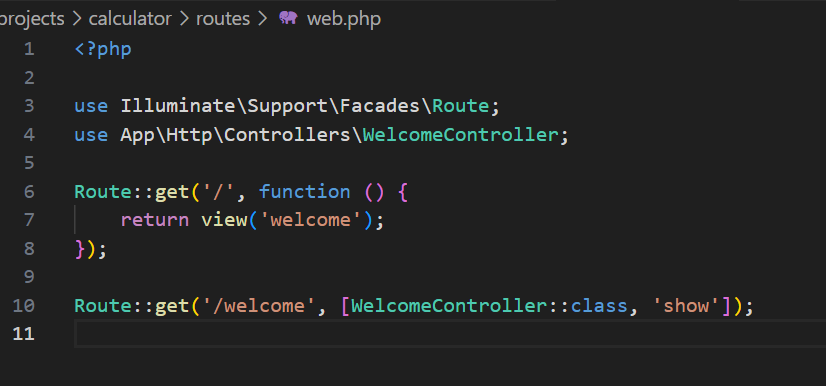

- Membuat controller WelcomeController.
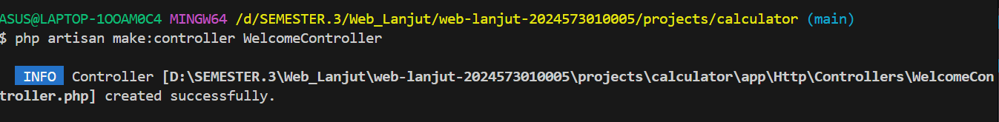

- Buat view mywelcome.blade.php.
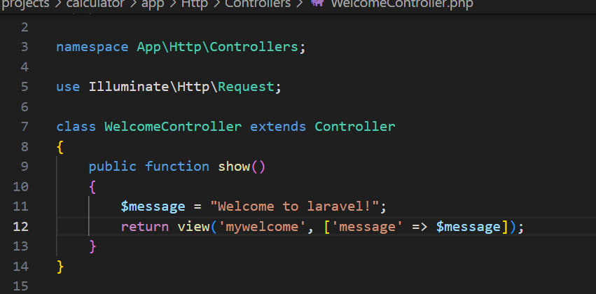

- Jalankan aplikasi menggunakan perintah
php artisan serve 
ini hasilnya :
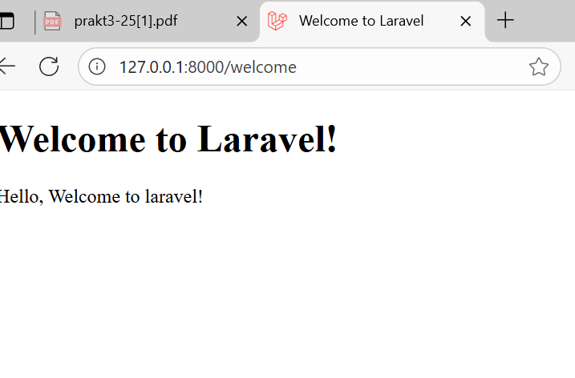

2.2 Praktikum 2 – Membuat Aplikasi Sederhana "Calculator"
- Tambahkan route untuk kalkulator.
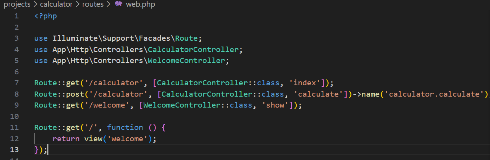

- Buat controller CalculatorController.
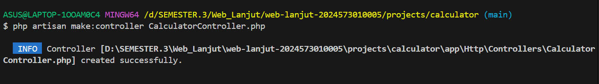

- Tambahkan view calculator.blade.php
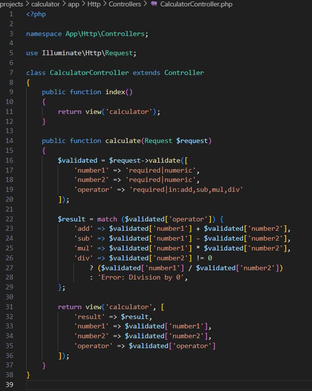

- Jalankan aplikasi dengan beberapa input berbeda.

 ini hasil operasi dari penjumlahan:
 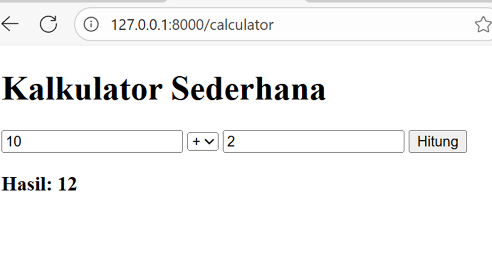

 ini hasil operasi dari pengurangan:
 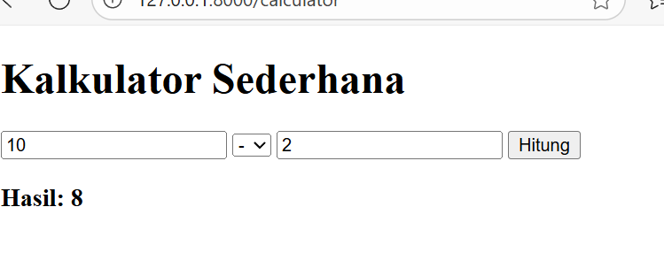

 ini hasil operasi dari perkalian:
 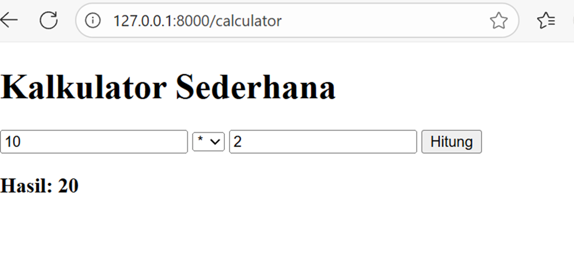

 ini hasil operasi dari pembagian:
 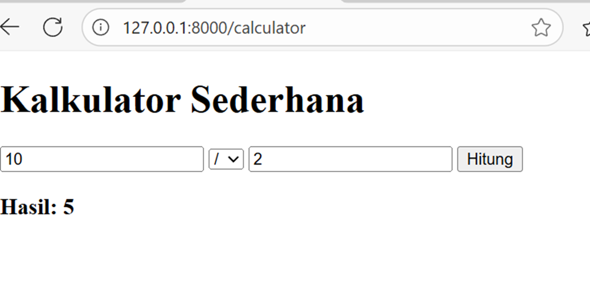

---

## 3. Hasil dan Pembahasan
hasil dari praktikum yang dilakukan:

- Aplikasi berhasil berjalan sesuai harapan. Route/welcome menampilkan halalman sambutan, sedangkan /calculator menampilkan form kalkulator dan hasil perhitungan.

- jika ada input yang salah (misalnya teks non-nnumerik atau pembagian dengan 0), laravel menampilkan pesan error validasi atau hasil "error:Division by zero".

- validasi input bekerja dengan $request->validate(), sehingga pengguna dipaksa memasukkan data yang benar.

- peran masing-masing komponen (Route, Controller, View) dalam program yang dibuat adalah:
    * Route -> Menghubungkan URL dengan controller.
    * Controller -> Menangani logika,validasi, dan perhitungan.
    * View -> Menampilkan data hasil ke pengguna.

---

## 4. Kesimpulan
 kesimpulan dari praktikum ini adalah bahwa laravel memudahkan pengembangan aplikasi web dengan arsitektur MVC. Routing, controllrr,view,dan Blade template saling melengkapi untuk menghasilkan eplikasi yang terstruktur. Middleware dan validasi request memberikan keamanan tambahan serta meminimalisir error.

---

## 5. Referensi
Adapun sumber yang saya baca adalah:
1. Modul 2: https://hackmd.io/@mohdrzu/B1zwKEK5xe
2. Laravel Fundamental: https://id.scribd.com/document/678901652/Teori-9-Laravel-Fundamental
3. Introduction to Laravel and MVC Framework: https://www.geeksforgeeks.org/php/introduction-to-laravel-and-mvc-framework/

---