# Laporan Modul 3: Laravel Controller
**Mata Kuliah:** Workshop Web Lanjut   
**Nama:** [Izzati Nurvira]  
**NIM:** [2024573010005]  
**Kelas:** [TI 2C]  

---

## Abstrak 

Laporan ini adalah berisi hasil praktikum dari Modul 3 tentang Laravel Controllers. Tujuan dari praktikum ini adalah untuk memahami peran dan fungsi controller dalam arsitektur MVC pada framework Laravel 12. Pada praktikum ini Mahasiswa diharapkan mampu membaut dan mengimplementasikan berbagai jenis controller, seperti basic,resource. Didalam praktikum ini juga bagaimana cara mennagani permintaan(request), memvalidasi input, serta mengembalikan berbagai jenis respons dari controller.

---

## 1. Dasar Teori
- Pengertian Controller
    Controller adalah komponen dalam arsitektur MVC yang berfungsi sebagai penghubung antara model dan view. Controller menerima permintaan dari pengguna melalui route, memproses data dengan bantuan model, dan mengembalikan hasilnya ke View.

- Jenis-jenis Controller di laravel
    1. Basic Controller - Digunakan untuk menamoung beberapa metode logika dalam satu kelas.
    2. Resource Controller - Digunakan untuk operasi CRUD dengan konvensi RESTful.
    3. Invokable Controller - digunakan untuk aksi tunggal dengan satu metode __invoke().

- Route dan Controller
    Route digunakan untuk mengarahkan permintaan ke controlller tertentu. Contohnya:

        Route::get('/home', [PageController::class, 'home']);

- Grouping Route
    Laravel menyediakan fitur route grouping untuk mengelompokkan rute yang memiliki kesamaan fungsi agar lebih rapi dan efisien, misalnya dengan:

        Route::controller(UserController::class)->group(function () {
        Route::get('/users', 'index');
        Route::get('/users/{id}', 'show');
        });

- Prefix dan Namespace
    Penggunaan prefix dan namespace berguna untuk mengatur rute berdasarkan kategori, seperti admin atau user. Contoh:

        Route::prefix('admin')->group(function () {
        Route::get('/dashboard', [DashboardController::class, 'index']);
        });

- Validasi Request
    Controller juga dapat melakukan validasi input agar data yang dikirim pengguna sesuai aturan:
        $request->validate([
        'name' => 'required|string|max:255',
        'email' => 'required|email'
        ]);

---

## 2. Langkah-Langkah Praktikum

2.1 Praktikum 1 – Menangani Request dan Response View di Laravel 12

- Membuat Project baru bernama lab-view

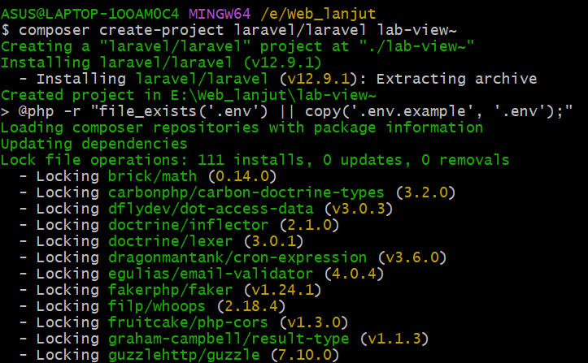

- Membuat controller DemoController.

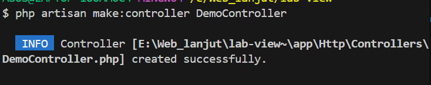

- Tambahkan metode pada DemoController.php untuk menampilkan view dan menangani parameter

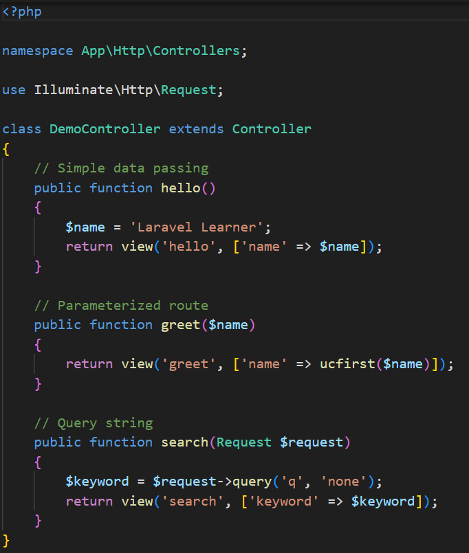

- Definisikakn rute pada route/web.php

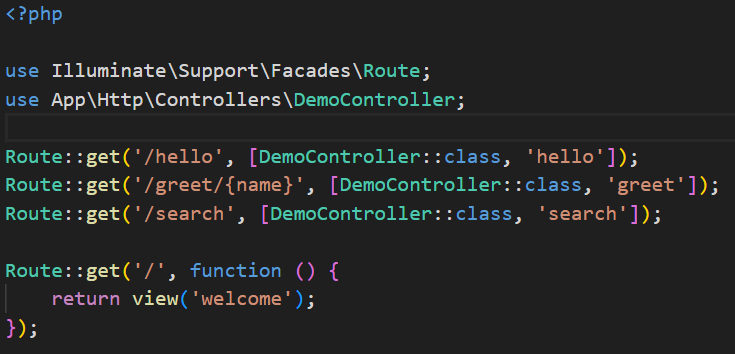

- Buat 3 file view:

    - Hello.blade.php

        isi dengan kode berikut:

        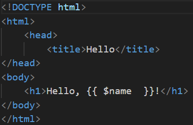

    - greet.blade.php

        isi dengan kode berikut:

        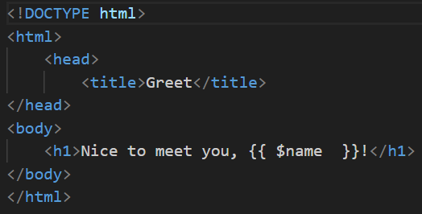

    - search.blade.php

        isi dengan kode berikut:

        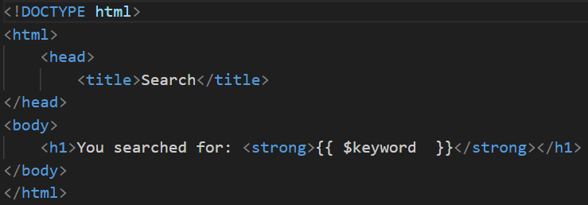

- Jalankan aplikasi menggunakan perintah

php artisan serve

Akses http://127.0.0.1:8000/hello → Menampilkan:

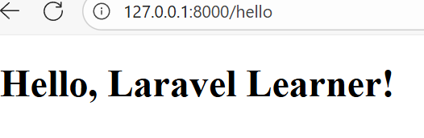

Akses http://127.0.0.1:8000/greet/Izzati → Menampilkan:

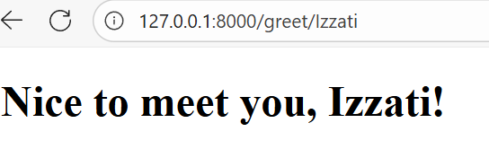

Akses http://127.0.0.1:8000/search?q=laravel → Menampilkan:

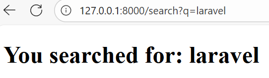

2.2 Praktikum 2 – Menggunakan group Route
- Buat project baru menggunakan perintah:

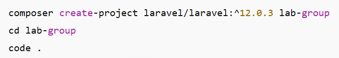

- Buat controller PageController dengan perintah:

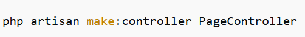

- Tambahkan tiga metode dalam PageController: home(), about(), dan contact().

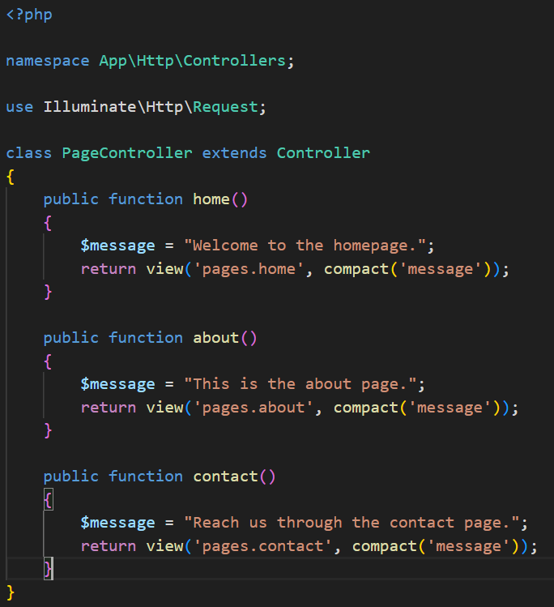

- Definisikan pengelompokan rute pada routes/web.php

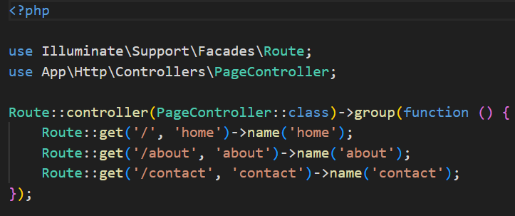

- Buat 3 view di resource/views/pages/
    - home.blade.php

        isi dengan kode berikut:

        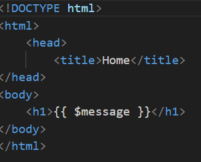

    - about.blade.php

        isi dengan kode berikut:

        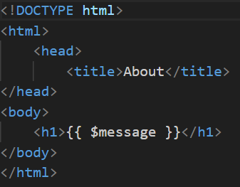

    - contact.blade.php

        isi dengan kode berikut:

        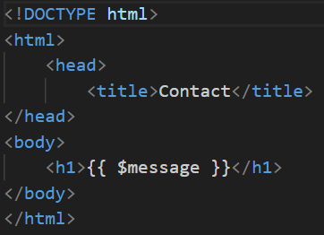

- Jalankan dengan perintah

php artisan serve

Hasil uji coba

http://127.0.0.1:8000/ → Menampilkan halaman Home:

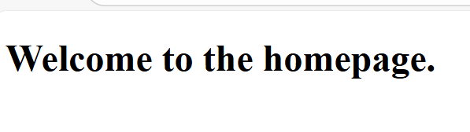

http://127.0.0.1:8000/about → Menampilkan halaman About:

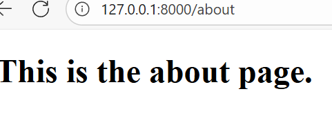

http://127.0.0.1:8000/contact → Menampilkan halaman Contact:

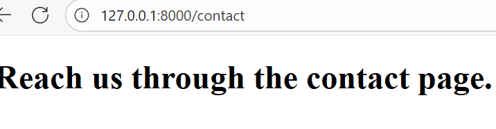

---

2.3 Praktikum 3 – Pengelompokan Prefix dengan Namespace Rute di Laravel 12
- Buat proyek baru:

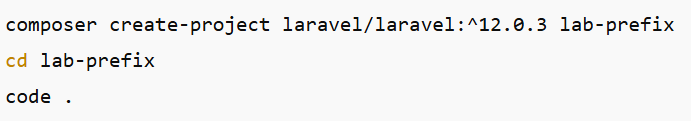

- Buat 2 controller di namespace Admin:

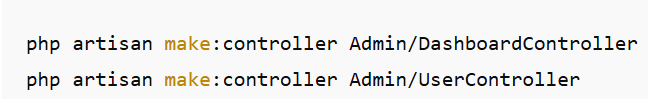

- Definisikan rute prefic=x admin di routes/web.php

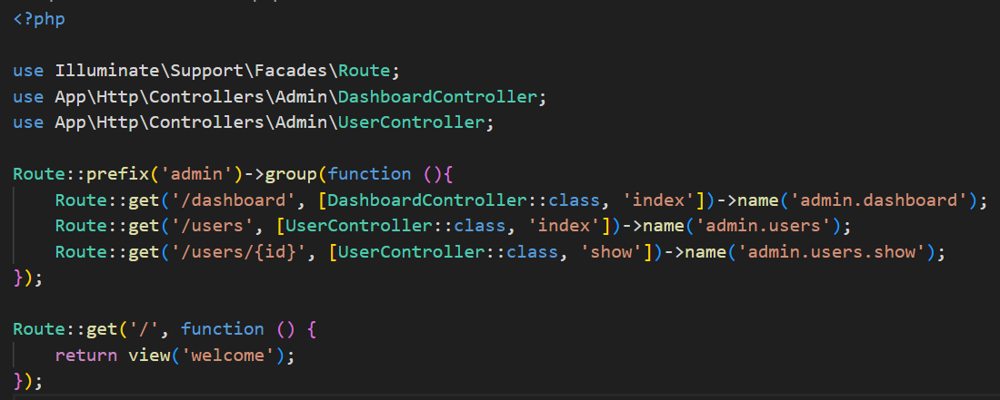

- Buat view di folder resources/views/admin/
    - dashboard.blade.php

        Isi dengan kode berikkut:

        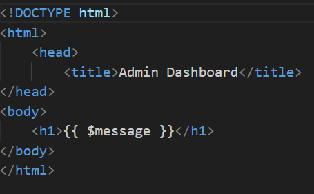

    - users/index.blade.php

        isi dengan kode berikut:

        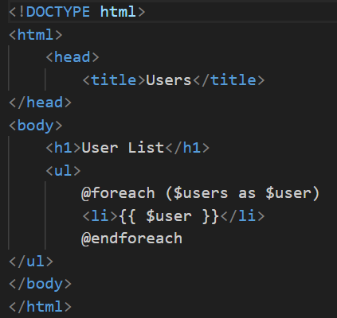

    - users/show.blade.php

        isi dengan kode berikut:

        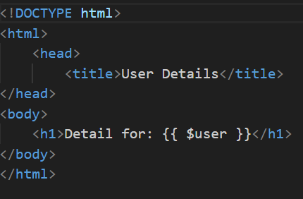

- Jalankan dengan perintah

php artisan serve

Hasil Uji Coba:

http://127.0.0.1:8000/admin/dashboard → Menampilkan halaman Dashboard:

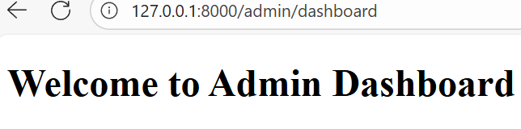

http://127.0.0.1:8000/admin/users → Menampilkan daftar pengguna:

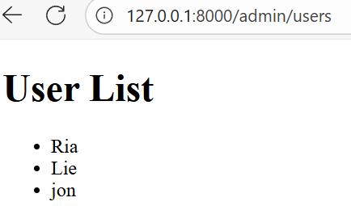

http://127.0.0.1:8000/admin/users/izzati → Menampilkan detail pengguna izzati:

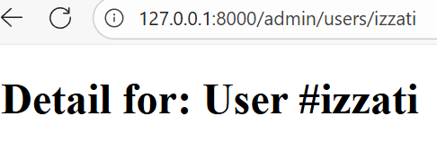

## 3. Hasil dan Pembahasan
hasil dari praktikum yang dilakukan:

- Semua controller berhasil dibuat dan berfungsi sesuai tujuan praktikum.

- Rute dapat memanggil metode controller dengan benar, baik tunggal maupun melalui pengelompokan.

- Penggunaan route grouping dan prefix membuat struktur kode lebih rapi dan mudah dikelola.

- Controller juga berhasil memproses data, meneruskan parameter, dan menampilkan hasil ke view.

- Dengan namespace Admin, aplikasi menjadi lebih terorganisir dan cocok untuk pengembangan modul seperti panel admin.

---

## 4. Kesimpulan
 Dari praktikum ini dapat disimpulkan bahwa controller berperan penting dalam mengatur logika aplikasi dan menghubungkan antara route, model, dan view pada framework Laravel 12. Dengan memahami berbagai jenis controller serta teknik route grouping, prefix, dan namespace, mahasiswa mampu membangun aplikasi web yang modular, efisien, dan mudah dikembangkan. Praktikum ini juga memperkuat pemahaman tentang struktur MVC yang menjadi fondasi utama dalam pengembangan aplikasi berbasis Laravel.

---

## 5. Referensi
Adapun sumber yang saya baca adalah:
1. Modul 3: Laravel Controller – https://hackmd.io/@mohdrzu/B1zwKEK5xe
2. Dokumentasi Resmi Laravel 12 – https://laravel.com/docs/12.x/controllers
3. Tutorialspoint – Laravel Controllers and Routing
4. GeeksforGeeks – Understanding MVC and Routing in Laravel

---