# Laporan Modul 4: Laravel Blade Template Engine 
**Mata Kuliah:** Workshop Web Lanjut   
**Nama:** [Izzati Nurvira]  
**NIM:** [2024573010005]  
**Kelas:** [TI 2C]  

---

## Abstrak 

Laporan ini berisi hasil praktikum dari Modul 4 tentang Laravel Blade Template Engine. Tujuan dari praktikum ini adalah memahami cara kerja sistem templating Blade yang digunakan Laravel untuk membuat tampilan halaman web menjadi dinamis, rapi, dan mudah dikelola. Melalui praktikum ini, mahasiswa mempelajari konsep dasar Blade seperti penggunaan sintaks @extends, @yield, @include, serta pembuatan layout, partials, dan komponen agar tampilan website Laravel menjadi lebih efisien dan terstruktur.

---

## 1. Dasar Teori
- Blade Template Engine
    Blade adalah templating engine bawaan Laravel yang memungkinkan developer menulis tampilan dengan sintaks yang lebih sederhana dibandingkan HTML murni. Blade tidak membatasi penggunaan kode PHP dan secara otomatis meng-cache template untuk meningkatkan performa.

- Layout dan Template Inheritance
    Blade mendukung template inheritance dengan menggunakan @extends untuk mewarisi layout utama, dan @section serta @yield untuk mengatur bagian isi yang dapat diubah dari view turunan.

- Directive Blade
    Blade menyediakan banyak directive seperti @if, @foreach, @include, dan @csrf untuk mempermudah penulisan logika di dalam tampilan tanpa perlu menulis kode PHP mentah.

- Partials dan Components
    Partials (@include) digunakan untuk menyertakan potongan kode tampilan yang sering digunakan seperti header atau footer.
    Components (<x-nama-component>) digunakan untuk membuat bagian tampilan yang dapat dipanggil ulang dengan parameter tertentu.

- Theme Switching (Light/Dark Mode)
    Laravel dapat mengatur tema tampilan menggunakan session. Dengan tombol pengubah tema, pengguna bisa memilih mode terang atau gelap tanpa perlu me-reload halaman seluruhnya.

---

## 2. Langkah-Langkah Praktikum

2.1 Praktikum 1 – Passing Data ke Blade View

- Membuat controller baru bernama DasarBladeController.php di folder app/Http/Controllers/.
    dengan perintah:

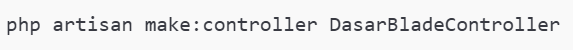

- isi dengan kode ini:

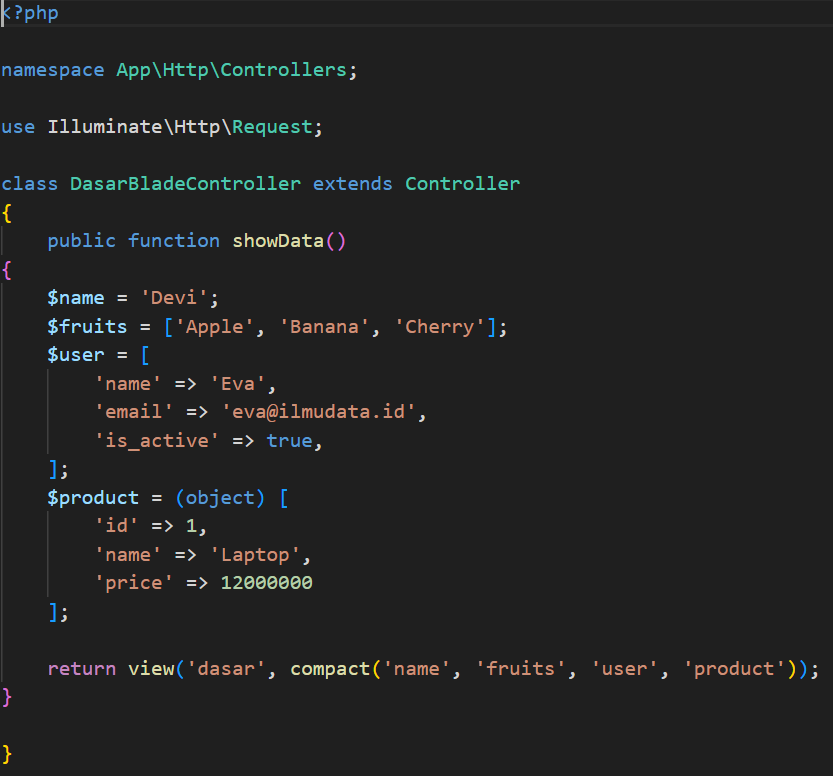

- menambahkan route di routes/web.php

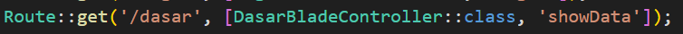

- Membuat file view resources/views/dasar.blade.php berisi:

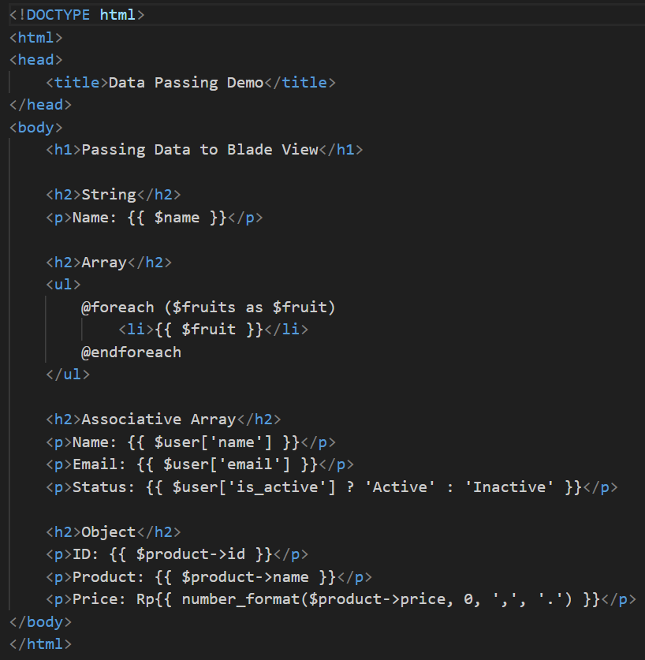

- Jalankan php artisan serve lalu akses:

http://127.0.0.1:8000/dasar:
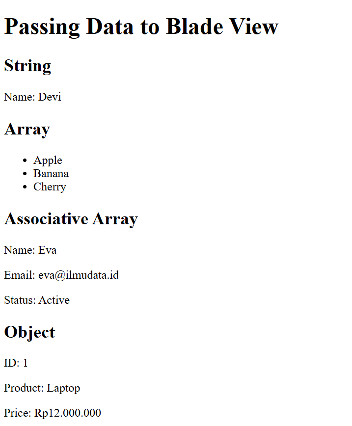

2.2 Praktikum 2 – Struktur Kontrol Blade
- Buat controller LogicController.php untuk menguji berbagai struktur kontrol.

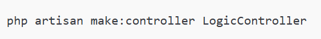

- Isi dengan kode berikut:

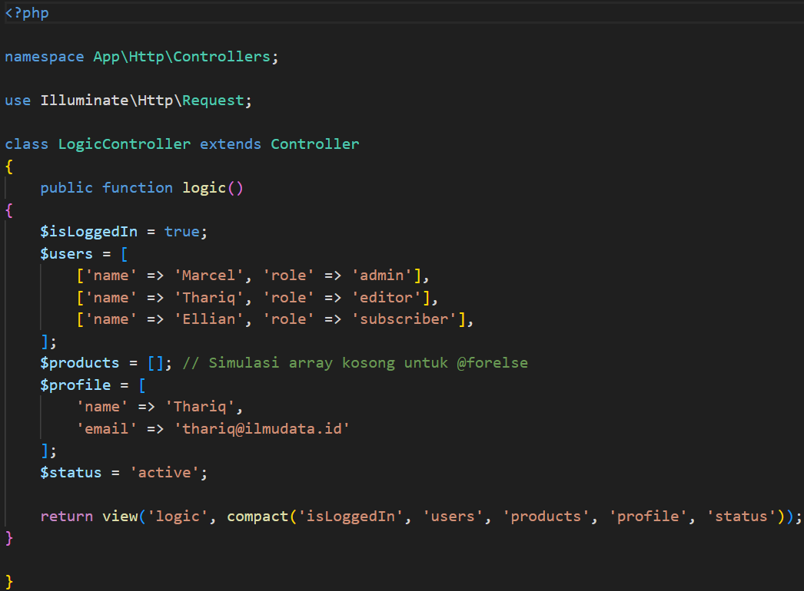

- Tambahkan route di routes/web.php:

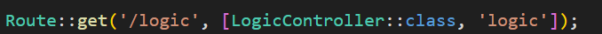

- Buat view resources/views/logic.blade.php berisi:

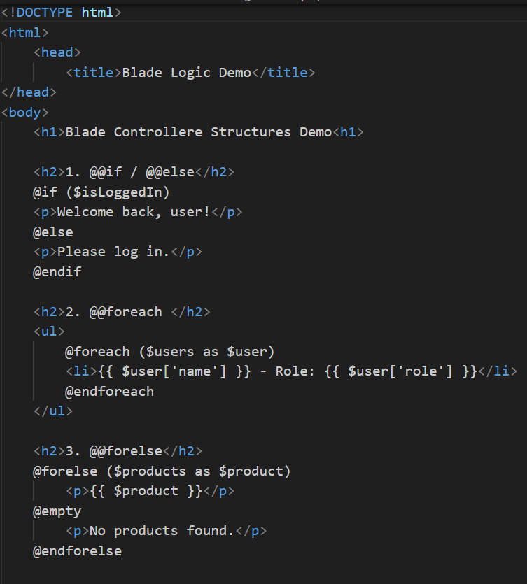

- Jalankan dengan perintah Php artisan serve:
http://127.0.0.1:8000/logic:
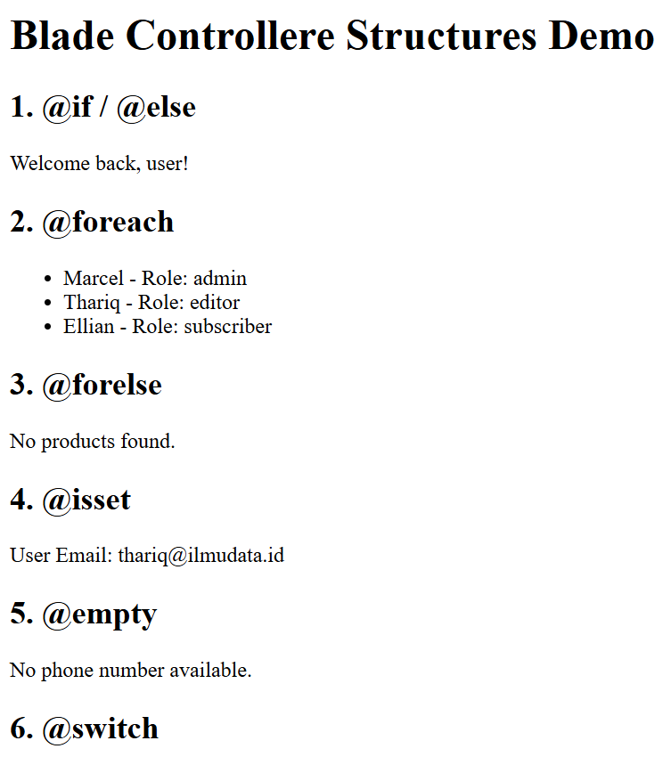

2.3 Praktikum 3 – Layout dan Personalisasi
- Buat folder resources/views/layouts lalu buat file app.blade.php sebagai layout utama menggunakan Bootstrap:

isi file dengan:

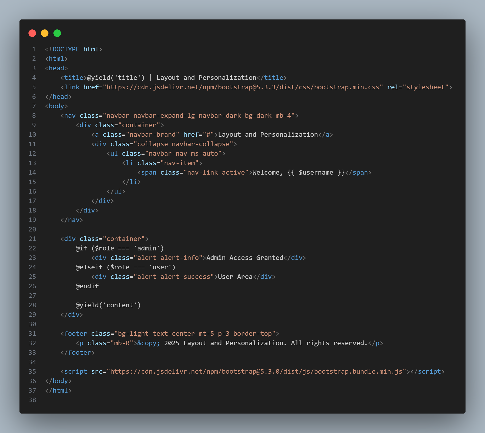

- Buat PageController.php dan tambahkan dua fungsi:

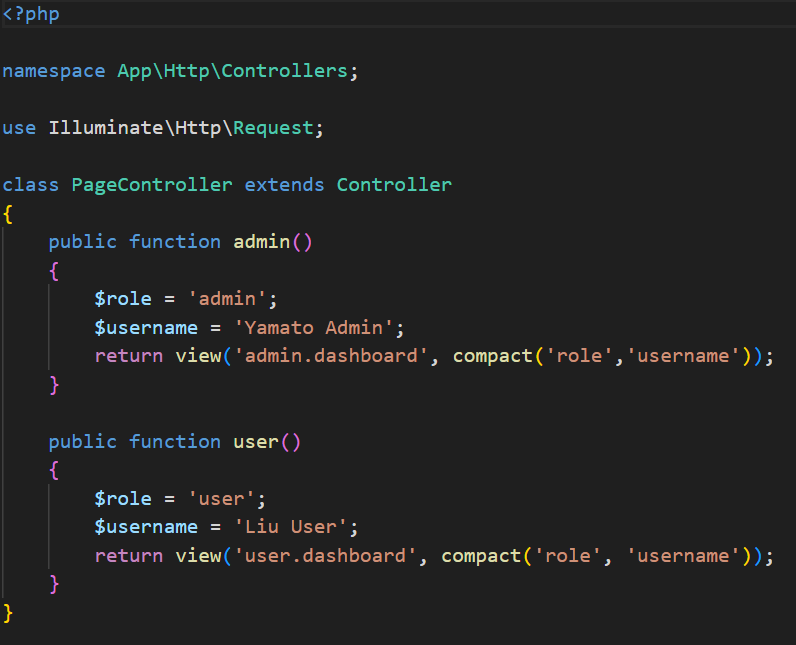

- Definisikan rute di routes/web.php

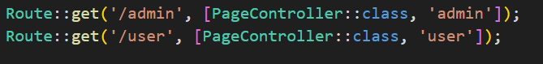

- Buat 2 view di folder resources/views/
    - admin/dashboard.blade.php

        Isi dengan kode berikkut:

        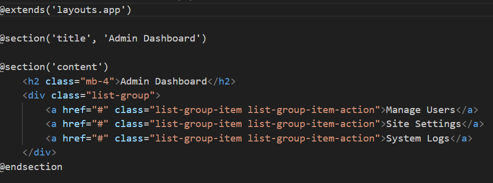

    - users/dashboard.blade.php

        isi dengan kode berikut:

        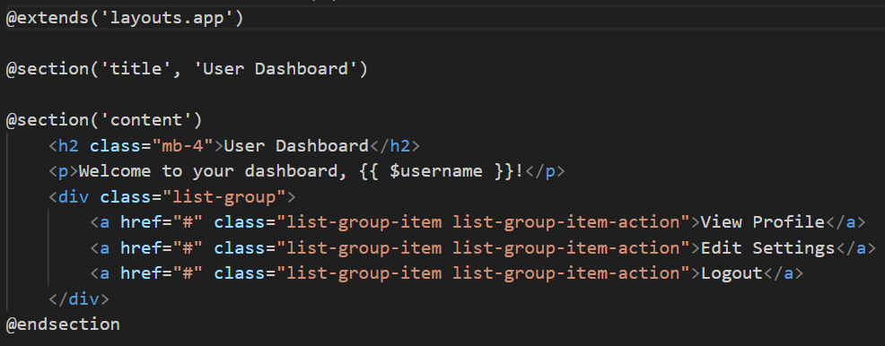

- Jalankan dengan perintah

php artisan serve

Akses dengan:

http://127.0.0.1:8000/admin 
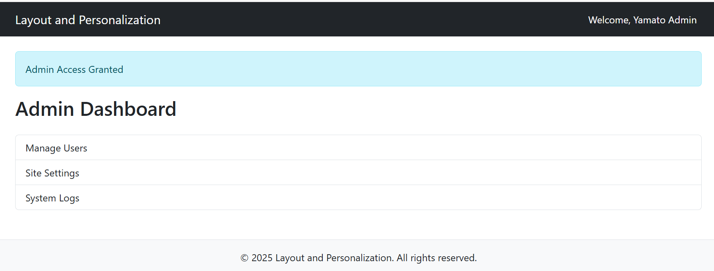

http://127.0.0.1:8000/user
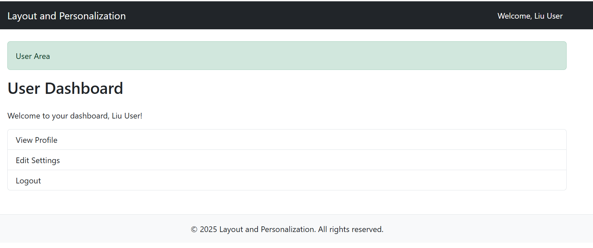

## 3. Hasil dan Pembahasan
hasil dari praktikum yang dilakukan:

- Dari hasil praktikum, sistem Blade Template Engine berhasil digunakan dengan baik.
- Halaman layout utama dapat digunakan ulang oleh semua halaman dengan @extends.
- Partial view seperti navigasi dan footer tampil otomatis di setiap halaman.
- Komponen Blade (<x-feature-card>, <x-team-member>, dan <x-footer>) bekerja dengan parameter dinamis untuk menampilkan data berbeda pada setiap halaman.
- Fitur theme switching berjalan dengan menyimpan nilai tema di session dan menyesuaikan warna tampilan menggunakan class Bootstrap.
- Semua halaman dapat diakses tanpa error, dan tampil dengan mode terang/gelap sesuai pilihan pengguna.

---

## 4. Kesimpulan
 Dari hasil praktikum ini dapat disimpulkan bahwa:

1. Laravel Blade Template Engine mempermudah pembuatan tampilan web dengan sintaks yang sederhana dan terstruktur.
2. Konsep layout inheritance, partials, dan components membantu efisiensi kode serta mempermudah pengelolaan tampilan.
3. Penerapan fitur theme switching menunjukkan kemampuan Blade untuk berinteraksi dengan session Laravel.
4. Dengan memanfaatkan Blade, developer dapat membangun antarmuka web yang konsisten, dinamis, dan mudah dipelihara.

---

## 5. Referensi
Adapun sumber yang saya baca adalah:
1. Modul 4: Larave, Blade Template Engine – https://hackmd.io/@mohdrzu/r1AIUzWpll
2. Dokumentasi Resmi Laravel: https://laravel.com/docs/11.x/blade
3. Tutorial Laravel Blade Components: https://www.geeksforgeeks.org/laravel-blade-template-engine/

---